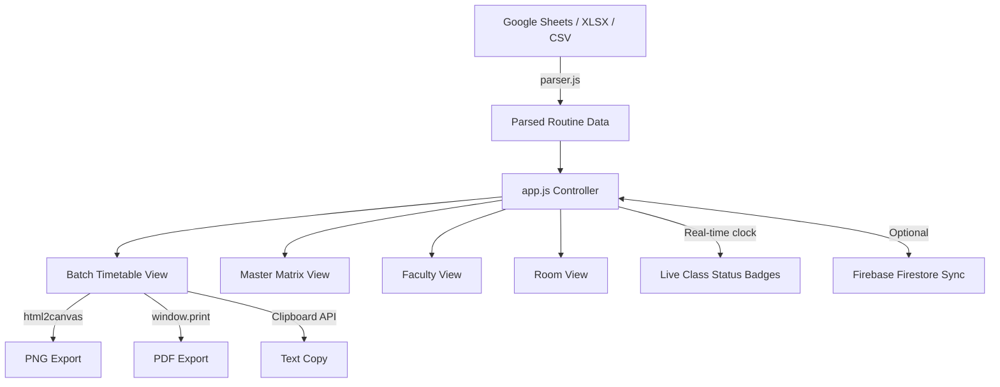

<div align="center">

<br/>

```
██████╗ ██╗██╗   ██╗    ██╗ ██████╗███████╗
██╔══██╗██║██║   ██║    ██║██╔════╝██╔════╝
██║  ██║██║██║   ██║    ██║██║     █████╗  
██║  ██║██║██║   ██║    ██║██║     ██╔══╝  
██████╔╝██║╚██████╔╝    ██║╚██████╗███████╗
╚═════╝ ╚═╝ ╚═════╝     ╚═╝ ╚═════╝╚══════╝
           ROUTINE GENERATOR
```

# 🎓 DIU ICE Class Routine Generator

**The smartest, fastest, and most beautiful class routine tool for ICE students & faculty at Daffodil International University.**

<br/>

[](https://foysalhridoy.github.io/ICEroutine/)
[](https://github.com/foysalhridoy/ICEroutine/stargazers)
[](LICENSE)
[](https://github.com/foysalhridoy)

<br/>


<br/>

</div>

---

## ✨ What Is This?

> **DIU ICE Routine Generator** is a zero-install, blazing-fast web app that transforms any Google Sheets routine link into a pixel-perfect, interactive class timetable — complete with live class tracking, faculty schedules, room views, and one-tap export to image, PDF, or text.

Built specifically for the **Department of Information & Communication Engineering (ICE)** at **Daffodil International University**, it handles every batch from `L1T1` to `L4T3` with real-time awareness of *which class is happening right now*.

---

## 🚀 Features at a Glance

<div align="center">

| Feature | Description |
|:---:|:---|
| ⚡ **Instant Load** | Pre-loaded with official Fall-2026 routine — zero setup needed |
| 🎓 **All 9 Batches** | `L1T1` `L1T2` `L1T3` `L2T1` `L2T3` `L3T1` `L3T3` `L4T1` `L4T3` |
| 🟢 **Live Class Tracker** | Real-time badge shows **Live Now / Next Up / Upcoming / Completed** |
| 📅 **Master Matrix** | Full department-wide routine in one scrollable view |
| 👨‍🏫 **Faculty View** | See any teacher's complete weekly schedule instantly |
| 🏫 **Room View** | Track room-by-room class allocations across all batches |
| 📸 **Export: Image** | High-res PNG screenshot — wallpaper-ready for mobile |
| 🖨️ **Export: PDF** | Clean A4 print stylesheet — perfect for physical notice boards |
| 📋 **Export: Text** | WhatsApp / Messenger-ready formatted text, one tap to copy |
| 📅 **Google Calendar** | Download `.ics` file — add recurring classes to Google/Apple Calendar |
| 🔄 **Live Sheet Sync** | Paste any Google Sheets link → routine updates live |
| 📂 **File Upload** | Drag & drop `.xlsx` or `.csv` — works fully offline |
| 📱 **Mobile-First** | Swipeable batch chips, sticky day column, card & table toggle |
| 🌐 **All Devices** | Fluid responsive design — phone, tablet, laptop, 4K display |

</div>

---

## 🖥️ Preview

<div align="center">

### Batch Timetable View
```
┌─────────────┬──────────┬──────────┬──────────┬──────────┬──────────┐
│   Time      │  Sunday  │  Monday  │ Tuesday  │Wednesday │ Thursday │
├─────────────┼──────────┼──────────┼──────────┼──────────┼──────────┤
│ 08:00-09:20 │ CSE 411  │ ICE 321  │  OFFDAY  │ ICE 401  │ CSE 411  │
│             │  Room101 │  Room204 │          │  Room107 │  Room101 │
├─────────────┼──────────┼──────────┼──────────┼──────────┼──────────┤
│ 09:30-10:50 │ ICE 301  │  OFFDAY  │ ICE 321  │  OFFDAY  │ ICE 301  │
│             │  Room204 │          │  Room204 │          │  Room204 │
└─────────────┴──────────┴──────────┴──────────┴──────────┴──────────┘
```

### 🟢 Real-Time Status Badges
| Badge | Meaning |
|:---:|:---|
| 🔴 **● LIVE NOW** | Class is actively running right now |
| 🟡 **◐ NEXT UP** | Starts in less than 30 minutes |
| 🔵 **◌ UPCOMING** | Scheduled later today |
| ✅ **✓ COMPLETED** | Class has already ended today |

</div>

---

## 📦 Tech Stack

<div align="center">


| Layer | Technology |
|:---:|:---|
| **Frontend** | Vanilla HTML5 + CSS3 + ES6+ JavaScript |
| **Styling** | Custom CSS with Glassmorphism & CSS Animations |
| **Data Source** | Google Sheets (CSV export) + Local XLSX/CSV |
| **Export** | `html2canvas` (PNG) · Browser Print API (PDF) · Clipboard API |
| **Calendar** | RFC 5545 `.ics` standard — Google & Apple Calendar |
| **Sync / DB** | Firebase Firestore (optional live sync) |
| **Parsing** | `SheetJS (xlsx)` for Excel file parsing |
| **Hosting** | GitHub Pages (free, CDN-backed) |

</div>

---

## 💻 Quick Start

### ▶ Option 1 — Just Open It
```
Double-click  index.html  →  Opens in any modern browser. Done. ✅
```

### ▶ Option 2 — Local Dev Server

```bash
# Python (built-in, no install needed)
python -m http.server 3000

# Node.js / npx
npx serve .

# Then visit:
http://localhost:3000
```

### ▶ Option 3 — GitHub Pages (Free Hosting)

```bash
# 1. Initialize git & push
git init
git add .
git commit -m "🚀 Initial commit — DIU ICE Routine Generator"
git remote add origin https://github.com/foysalhridoy/ICEroutine.git
git push -u origin main

# 2. Enable Pages:
#    GitHub Repo → Settings → Pages → Branch: main → Save

# 3. Your site goes live at:
#    https://foysalhridoy.github.io/ICEroutine/
```

---

## 📁 Project Structure

```
ICEroutine/
│
├── 📄 index.html          — Main app shell & UI layout
├── 🎨 styles.css          — Full design system, animations & responsiveness
├── ⚙️  app.js             — Core controller: routing, rendering, export logic
├── 📚 courses.js          — ICE syllabus: course codes, titles, credit hours
├── 🔍 parser.js           — Google Sheets CSV + XLSX parser & normalizer
├── 🔥 firebase-config.js  — Firebase Firestore sync service (optional)
│
└── 📁 data/
    └── 📊 routine.xlsx    — Offline fallback routine data
```

---

## 🎯 How to Use

```
1. 🌐  Open the app in your browser
2. 🎓  Click your batch chip  (e.g., L2T1, L3T3)
3. 📋  View your full weekly routine instantly
4. 🔄  Optional: Paste a new Google Sheets link → Fetch & Sync
5. 📤  Export:  [Image] · [PDF] · [Copy Text]
6. 👨‍🏫  Switch tabs:  Batch · Master Matrix · Faculty View · Room View
```

---

## 🔄 Syncing from Google Sheets

1. Open your routine Google Sheet
2. Go to **File → Share → Publish to Web**
3. Select **Sheet → CSV format** → Click **Publish**
4. Copy the generated link
5. Paste it in the app's **"Change Routine Sheet Link"** section → **Fetch & Sync**

> **💡 Tip:** The app auto-formats, parses, and caches the sheet data. Any updates to the sheet reflect instantly on next sync.

---

## 📱 Responsive Design

```
📱 Mobile  (< 480px)   → Card view · Swipeable batch chips · Compact toolbar
📟 Tablet  (480–768px) → Hybrid layout · Scrollable table
💻 Desktop (768px+)    → Full timetable · Side-by-side views
🖥️ 4K     (1440px+)   → Max-width container · Crisp typography
```

---

## 🏗️ Architecture Overview



---

## 🤝 Contributing

Contributions, issues, and feature requests are welcome!

```bash
# Fork the repository
# Create your feature branch
git checkout -b feature/amazing-feature

# Commit your changes
git commit -m "✨ Add amazing feature"

# Push to branch
git push origin feature/amazing-feature

# Open a Pull Request 🎉
```

> **📝 Note:** Please keep the codebase in vanilla JS — no frameworks. This app is intentionally zero-dependency for maximum portability.

---

## 📋 Changelog Highlights

| Version | Highlights |
|:---:|:---|
| **v3.0** | 🔴 Live class tracker · Glassmorphism UI · Master Matrix null-safety fix |
| **v2.5** | 🏫 Room View · 👨‍🏫 Faculty Modal with DIU profile links |
| **v2.0** | 📸 PNG export · 📋 WhatsApp text copy · 📅 `.ics` Calendar export |
| **v1.0** | ⚡ Initial release — Batch routine + Google Sheets sync |

---

## 📜 License

```
MIT License — Free to use, modify, and distribute.
Attribution appreciated but not required.
```

---

<div align="center">

<br/>

```
╔═══════════════════════════════════════════╗
║   Built for ICE students at DIU   ║
║   Department of Information &             ║
║   Communication Engineering               ║
║   Daffodil International University       ║
╚═══════════════════════════════════════════╝
```

### 👨‍💻 Developer

**Hridoy** · CSE, DIU

[](https://github.com/foysalhridoy)

<br/>

*If this project helped you, please consider giving it a ⭐ on GitHub!*

<br/>

</div>
